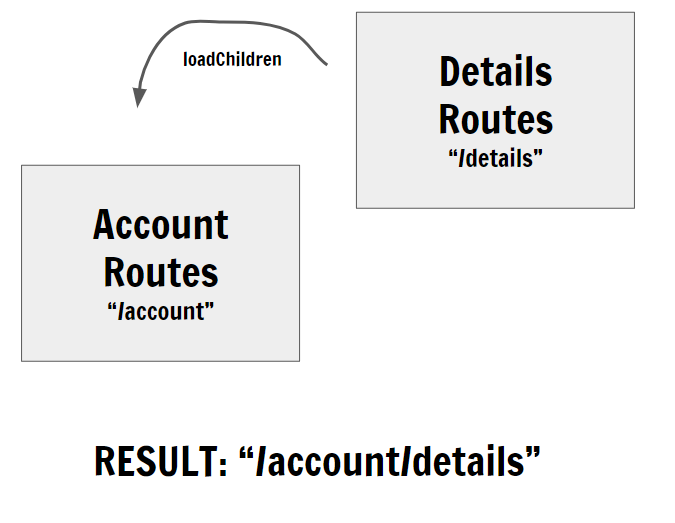

# Angular Routing — A Better Pattern For Large Scale Apps

# Angular Routing - 大规模应用中更好的模式

Sep 21, 2018

2018年9月21日

It’s been a while since my last post because I’ve been busy cooking you people some pretty interesting Angular testing learning material.

在发表完上一篇文章之后我沉寂了一段时间，因为我一直在忙着为人们 "烹饪" 一些关于 Angular 测试的有趣学习资料。

But today, I read the following tweet:

但今天，我读到了下面的推文：

> I wish someone could explain the purpose/benefit of putting routing into a separate "routing module" in @angular because for the life of me I can't see it, other than the idea of "hey, let's create another module because whey the heck not???
> 
> 我希望能有人解释一下在 @angular 中把路由拆分到 "路由模块" 中的目的/优点，因为我在日常工作中没能想明白，只知道 "嘿，让我们创建另一个模块吧，因为……恩，见鬼，我也不知道为什么"。
> 
> — @josepheames

And it got me inspired to share my pattern of configuring routes in large scale Angular apps.

它让我决定分享一种在大型 Angular 应用中配置路由的模式。

Since the beginning, when I read the [Angular Routing](https://angular.io/guide/router) docs, and saw the “Routing Module” pattern suggestion, I was confused.

从一开始，当我读到 [Angular Routing](https://angular.cn/guide/router) 文档时，就看到了这种对“路由模块”模式的建议，我糊涂了。

“Why do I need a separate module for routing?” I asked.

“为什么我要把路由功能拆分成一个单独的模块？”我问道。

Nobody answered because I was alone. 🙁

没人回答，因为当时就我自己。🙁

But then I said: “What the hell, let’s try it!” 😎

但后来我说：“到底是怎么回事，让我们来试试吧！”😎

And I started applying this pattern in one of the Angular 2 (yeah it was a while ago) apps I was beginning from scratch.

我开始在一些从头开始的 Angular 2 应用中套用这种模式（其实，也没多久）。

Some time went by, and the app grew.

随着时间的流逝，应用越来越多。

To keep things clean we started separating larger modules into smaller nested modules, but then, I started noticing a HUGE shortcoming when it came down to using nested routes.

为了保持清洁，我们开始把更大的模块拆分成更小的内嵌模块，但是当我开始使用嵌套路由时，我开始注意到一个巨大的缺点。

### Problem #1 — Redundant URL Prefixes

### 问题 ＃1 - 多余的 URL 前缀

Let’s say we have the following folder structure:

假设我们有以下文件夹结构：

```
app/
  app.module.ts
  app.routing.module.ts
  settings/
    settings.module.ts
    settings.routing.module.ts
      account
        account.module.ts
        account.routing.module.ts
          details
            details.module.ts
            details.routing.module.ts
```

Take `details.routing.module.ts` for example.

以 `details.routing.module.ts` 为例。

With the “Routing Module” approach we always begin our route URLs from the base URL.

在“路由模块”方式下，我们总是从基本 URL 开始定义路由 URL。

So every route in `details.routing.module.ts` will need to have the previous routes URLs (“settings/account” ) as its prefix:

因此，`details.routing.module.ts` 所有路由都要用以前的路由URL（`settings/account`）作为前缀：

```typescript
details.routing.module.ts
~~~~~~~~~~~~~~~~~~~~~~~~~
@NgModule({
  imports: [
    RouterModule.forChild([
      { 
        path: 'settings/account/details', 
        component: DetailsComponent
      },
      { 
        path: 'settings/account/details/some-other-route', 
        component: SomeOtherComponent
      }
    ])
  ],
  declarations: [DetailsComponent, SomeOtherComponent]
  exports: [RouterModule]
})
export class DetailsRoutingModule{ }
```

#### “Why is that a problem Shai?”

#### “为什么这是个问题？Shai（作者）？”

BECAUSE…

因为……

for medium to large size apps, these routes will repeat themselves over and over again.

对于大中型应用来说，这些路由会一遍又一遍地重复。

It could slow us down if we ever need to refactor parts of the apps which involve the routes.

如果我们要重构涉及这些路由的那部分应用，它可能会拖慢我们的速度。

We cannot just “plug” a module on top of a different module and expect it to work…

我们不可能把一个模块直接“插”到另一个模块上，并希望它能正常工作……

And if you’re thinking “but I can’t just move modules around anyway, it will break my app…”

你可能在想“但我总不能只把这些模块移过去就收工啊，那肯定会破坏我的应用……”

I got 2 things to say:

我要说两点：

1. **Router testing** — which I’ll talk about in the future.

   **路由器测试** - 我将在后面讨论这个问题。

1. **Variable based routerLinks** — which I’ll talk about later in this post.

   **基于变量的 routersLinks**（稍后我会讲）。

### Problem #2— Lazy Loading

### 问题＃2 - 惰性加载

If for example, we needed to turn `details.module.ts` into a lazy loaded module, we would have to go ahead and remove all those prefixes from all the details’ routes.

例如，如果我们要把 `details.module.ts` 变成一个惰性加载的模块，我们就得继续从所有细部路由中删除那些前缀。

```typescript
details.routing.module.ts (LAZY)
~~~~~~~~~~~~~~~~~~~~~~~~~~~~~~~~~
@NgModule({
  imports: [
    RouterModule.forChild([
      { 
        path: 'details', // <-- no more prefix
        component: DetailsComponent
      },
      { 
        path: 'details/some-other-route', 
        component: SomeOtherComponent
      }    
    ])
  ],
  declarations: [DetailsComponent, SomeOtherComponent]
  exports: [RouterModule]
})
export class DetailsRoutingModule{ }
```

**Why?** because routes of lazy loaded modules become the `children` of the parent loading route.

**为什么？**因为这些惰性加载模块的路由会成为父加载路由的子路由（`children`）。

WAT?

什么？

Yeah, you can imagine the child routes of the lazy loaded module “stacking” on top of the parent loading route.

是的，你可以把惰性加载模块的子路由想象成“堆叠”在父加载路由之上。



By the way, that’s why we use `loadChildren` to load lazy loaded modules, as if to say: “Set this sucker’s routes as the loading route’s children”

这就是为什么我们使用 `loadChildren` 来加载惰性加载模块的原因，就好像在说：“把这玩意儿中的路由设成这个加载者路由的子路由”。

#### “Again, why is that a problem Shai?”

#### “再说细点，Shai，为什么这是个问题？”

In one word: inconsistency.

一个词：不一致。

( In two words: in-consistency 👏 👏 👏 “good job Shai!”)

（两个词：不~~~一致 👏👏👏“干得好！Shai！”）

When we scale up our apps, we want things to be consistent.

当我们扩展应用时，我们会希望事情总能保持一致。

We want to reduce the amount of decisions we need to make, so every inconsistency creates unnecessary noise.

我们希望减少要做的决策，因为每处不一致都会带来不必要的噪音。

“Should I remove the prefix here or leave it? why can’t it just be the same as the other routes…?”

“我应该在这里删除这个前缀还是留下它？为什么不能和其它路由一样呢？“

We want to reduce these 👆 questions.

我们希望能减少这些👆问题。

#### Demo Project To Show The Problem:

#### 此问题的演示项目：

Here is an example project that I created for you to see what I’m talking about:

这是一个我为你创建的示例项目，它能帮你弄清楚我在说什么：

[**angular-routing-module-pattern-issues - StackBlitz** *该程序用于演示这种路由模式*的问题](https://stackblitz.com/edit/angular-routing-module-pattern-issues?embed=1&file=src/app/app-routing.module.ts)

### SOLUTION: The “routes.ts” pattern.

### 解决方案：“routes.ts” 模式。

To solve these problems I’ve separated the routes array into its own `routes.ts` file (and removed the `routing.module.ts` files)

为了解决这些问题，我把 routes 数组拆分到了独立的 `routes.ts`文件中（并删除了 `routing.module.ts` 文件）

```
app/
  app.module.ts
  app.routes.ts
  settings/
    settings.module.ts
    settings.routes.ts
      account
        account.module.ts
        account.routes.ts
          details
            details.module.ts
            details.routes.ts
```

Now, for the eager loaded routes, to achieve the same behavior as the lazy loaded routes (meaning, to stack them up on top their parent route without knowing its prefix) I use this simple trick:

对于急性加载的路由来说，要实现与惰性加载路由一样的行为（也就是说，把它们叠加到父路由之上而不用知道它的前缀），我就会用到这个简单的技巧：

I load the nested routes as the value of the `children` property under their parent loading route.

我把这些嵌套的路由作为其父路由下的 `children` 属性的值进行加载。

```typescript
details.routes.ts
~~~~~~~~~~~~~~~~~
export const DETAILS_ROUTES = [
  { path: '', component: DetailsComponent },
  { path: 'some-other-route', component: SomeOtherComponent },
];
account.routes.ts
~~~~~~~~~~~~~~~~~
import { DETAILS_ROUTES } from './details/details.routes';
export const ACCOUNT_ROUTES = [
  { path: '', component: AccountComponent },
  { path: 'details', children: DETAILS_ROUTES }
];
```

That way, I keep everything modular and pluggable.

用这种方式，我可以保持一切都是模块化和可插拔的。

I do this for **all**the eager loaded routes.

我对**所有**急性加载路由都做了这些。

### “But what about the lazy loaded module routes?”

### “那些惰性加载的模块路由呢？”

Good question!

好问题！

Let’s say we wanted to turn `details.module.ts` into a lazy loaded module.

假设我们想把 `details.module.ts` 变成一个惰性加载的模块。

The beautiful thing about this pattern is that it doesn’t require a whole lot of changes to do so.

这种模式的美妙之处在于，它不需要进行太多的修改。

Instead of loading the `DETAILS_ROUTES` array in the parent route’s `children` property, we can just load it in the`forChild` of the `details.module.ts`

我们不用在 `DETAILS_ROUTES` 路由的 `children` 属性中加载 `DETAILS_ROUTES` 数组，而只需把它加载到 `details.module.ts` 的 `forChild` 中。

Like so:

就像这样：

```typescript
details.module.ts
~~~~~~~~~~~~~~~~~
@NgModule({
  imports: [
    RouterModule.forChild(DETAILS_ROUTES)
  ]
})
export class DetailsModule { }
```

And from the `account.routes.ts` we change the `children` into `loadChildren` and load the module itself:

在 `account.routes.ts` 中，我们把 `children` 改成 `loadChildren` 并加载该模块：

```typescript
account.routes.ts
~~~~~~~~~~~~~~~~~
export const ACCOUNT_ROUTES = [
  { path: '', component: AccountComponent },
  { 
    path: 'details', 
    loadChildren: './details/details.module#DetailsModule'
  }
];
```

That it!

就这样！

Everything else stays the same. 🎉 🎉

其它的一切都保持不变。 🎉🎉

This way, it’s easy peasy to turn eager modules into lazy ones and still keep the same convention and consistency across your code base.

这种方式下，很容易让 eager 模块变成惰性加载模块，同时在整个代码库中保持相同的约定和一致性。

### BONUS: Variables instead of URL strings

### 额外收获：用变量代替 URL 字符串

I HATE duplicated strings!

我**讨！厌！**重复的字符串！


Some guy that probably hates duplicated strings as well… who happens to also wear a squirrel suit.

有些人可能会讨厌那些重复的字符串……他们可能还穿着松鼠套装。

Maybe because I always encounter bugs whenever I use two exact strings in several places throughout my large apps.

也许是因为每当我在大型应用中的不同地方使用完全相同的字符串时，总是会遇到 bug。

So following a widely used pattern from the Java world, I started using variables instead plain strings for route URLs .

因此，遵循 Java 世界中广泛使用的模式，我开始使用变量而不是普通字符串来表示路由 URL。

That means that alongside each `routes.ts` file, I now also have a `routes.names.ts` file which looks like this:

这意味着，除了各个 `routes.ts` 文件之外，我现在还要有一个 `routes.names.ts` 文件，如下所示：

```typescript
export const accountRoutesNames = {
  DETAILS: 'details'
}
```

And I use it both in my `routes.ts` file :

我在的`routes.ts`文件中也会使用它：

```typescript
account.routes.ts
~~~~~~~~~~~~~~~~~
import { accountRoutesNames } from './account.routes.names';
export const ACCOUNT_ROUTES = [
{ path: '', component: AccountComponent },
{ 
    path: accountRoutesNames.DETAILS, 
    loadChildren: './details/details.module#DetailsModule'
  }
];
```

And in my component files:

在我的组件文件中：

```typescript
account.components.ts
~~~~~~~~~~~~~~~~~~~~~
import { Component } from '@angular/core';
import { accountRoutesNames } from './account.routes.names';
@Component({
  selector: 'app-account',
  template: `
    <a routerLink="{{detailsLink}}">Go To Details</a>
  `
})
export class AccountComponent {
  detailsLink = `./${accountRoutesNames.DETAILS}`;
}
```

That way I could refactor with ease, and it won’t ever affect my router links or router tests as long as I keep using variables whenever I need a route URL string.

这样我就可以轻松地进行重构，只要每当我需要一个路由URL字符串时，就会继续使用变量，它就不会影响我的路由器链接或路由器测试。

Here is a project which demonstrates the solution:

这是一个展示解决方案的项目：

[**angular-routes-pattern-solution - StackBlitz** *Project that shows a new routing pattern*stackblitz.com](https://stackblitz.com/edit/angular-routes-pattern-solution?embed=1&file=src/app/app.routes.ts "https&#x3A;//stackblitz.com/edit/angular-routes-pattern-solution?embed=1&file=src/app/app.routes.ts")

[**angular-routes-pattern-solution - StackBlitz** *该项目展示了一种新的路由模式*](https://stackblitz.com/edit/angular-routes-pattern-solution?embed=1&file=src/app/app.routes.ts "https&#x3A;//stackblitz.com/edit/angular-routes-pattern-solution?embed=1&file=src/app/app.routes.ts")

### To Summarize:

### 总结一下：

1. The `routing.module` pattern has a few downsides: redundant url prefixes and inconsistency in lazy loaded modules routes.

   `routing.module` 模式有一些缺点：冗余的 url 前缀与惰性加载的模块路由不一致。

1. The solution: to use `routes.ts` files and load them either as `children` or in `forChild` in combination with `loadChildren`

   本解决方案：使用 `routes.ts` 文件，并把它们当作 `children` 加载或与 `loadChildren` 一起加载到 `forChild` 中

1. **BONUS**: use variable names to refer to URLs for better refactoring abilities.

   **额外收获** ：用变量名来引用 URL，以获得更好的重构能力。

This is the way I’ve been configuring my routes for quite sometime now and I find it to be very consistent and scalable.

这是我在很长一段时间内配置路由的方式，并且发现它非常具有一致性且可伸缩。

I hope this pattern / convention will serve you as well as it has served me and my clients.

我希望这种模式（或惯例）能帮到你和我的客户们。

Let me know if you have any questions / suggestions in the comments below.

如果您对下面的评论有任何疑问/建议，请与我们联系。

And stay tuned for some exciting news about Angular and Testing… 💪

敬请关注关于 Angular 和 Testing 的一些令人兴奋的新闻……💪

[Follow me on Twitter](https://twitter.com/shai_reznik)

[在 Twitter 上关注我](https://twitter.com/shai_reznik)

Or watch 👇 my Angular courses (especially on Testing):

或来看看我的 Angular 课程（特别是关于测试的）：

[school.HiRez.io](https://school.hirez.io)
