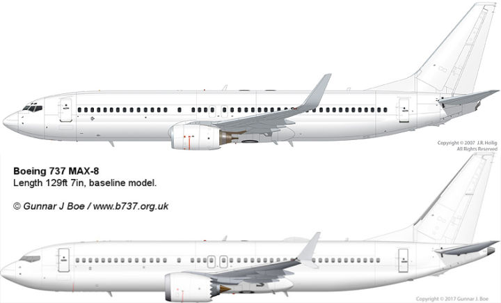

# 架构杂谈：737 MAX8 启示录

## 什么是架构？

老规矩，引用 wiki：

> 软件架构是有关软件整体结构与组件的抽象描述，用于指导大型软件系统各个方面的设计。

请在脑子里先记下两个关键词：整体和抽象。本文将给你一些更深入的理解。

## 架构值多少钱？

737 MAX8 事故是前一阵儿的大事件，那么，它跟架构有什么关系呢？我们来看一些业内人士的分析（来自 <https://www.zhihu.com/question/315360734/answer/619791865>）。我不了解相关技术，只根据我搜集的信息简要复述一下（可能不准确）：

上图是传统的 737，下图则是 737 MAX8，可以看出，新的发动机更加短粗。

从 1967 年 737-100 首飞以来，737 的架构在很长时间内都是富有竞争力的优秀架构，比如它的机翼较低，发动机挂在机翼下方，因此更方便地勤人员进行检修。
然而，他们要为 MAX8 换上的这款更省油的发动机比原有设计更加短粗，机翼下方没有足够的空间挂它。因此，波音的工程师选择把发动机略微往前挂一点，避开发动机上直径最大的部分，以保持和地面的最小距离。但，往前挂的代价是力学结构的改变，"这种发动机安装结构的改变在特定情况下就有可能会把机头推得上仰，从而陷入失速的风险"。波音无法在较低的成本下重新设计 737 的整体结构（架构），因此选择了通过软件来纠正它的方案。这种貌似低成本的补丁，埋下的巨大的安全隐患。

所以，架构值多少钱？显然，对这次 MAX8 事件波音会赔很多钱，至于间接损失多少钱，还是个未知数。

架构为什么重要？最简单的答案是：因为它真的很值钱。

## 架构是一种权衡

设计是一种权衡，而架构设计也是一种设计。比如说 737 的架构中较低的机翼，可以降低检修成本，而其代价是难以加挂更大的发动机。显然，在当时的需求和技术条件下，检修成本是显著的竞争优势，而更大的发动机尚未出现，甚至连需求都不那么紧迫。这种情况持续了四十多年，直到其竞争对手 A320 neo 的诞生。

A320 neo 采用了更先进、更省油，也更大的发动机。事实上，从基础原理上说，省油和直径之间有着某种内在的联系，因此在这种竞争条件下，省油变成了更迫切的需求，而更大的发动机则是由业务需求衍生出来的技术需求。这个需求，和架构固有的约束是冲突的。虽然我们可以通过打补丁的方式很聪明地解决掉这种冲突，但隐患仍然存在。这种架构级冲突点的"应力"很高，可能会在未来的某一刻被撕裂。

总结：考虑架构时，要重点考虑它当初做出的权衡，不了解这些权衡就没有真正理解这个架构。不要轻易使用"小聪明"去解决架构级冲突，而应该考虑调整架构，或者选用与架构没有本质性冲突的部件。

## 架构权衡的是整体利益

架构是一种权衡，但它权衡的是什么呢？是整体利益。

这种利益是广义的，比如安全、性能、重量、省油、易维护等等，每个部件都可以在很大范围内满足这些利益，比如你要省油到什么程度呢？你可以选用省油 5% 到 15% 之间的任何一款发动机，而付出的代价可能是削弱安全 1% 到 10%。这时候架构师应该如何权衡呢？这就要看你对需求的把握了。架构师不应该只理解技术，更应该理解商业，你要理解在商业上是否节油 10% 就已经有了足够的竞争力，或者是否可以通过其它方面来提供另一部分竞争力。这可能是一次在几十个子目标之间的艰难权衡。

显然，如果你无法找到安全和省油之间的平衡点，或者对省油有着狂热的迷之追求，就可能会付出巨大的代价。

总结：把整体利益拆分成多个清晰的子目标，深入理解每个子目标的商业利益、风险和代价，在各个子目标之间小心权衡。当你对某个子目标过度狂热时，请先冷静下来想想它会牺牲哪些子目标。

## 架构要不断演化

整体利益不是一成不变的，它会随着市场而不断变化，各个子目标的权重也在不断波动。这些波动范围可能会很小，也可能会由于客户特征或某个竞品的推出而发生剧烈变化。

要拥抱变化，但也要慎重。

如果你对架构还没有足够的理解，那么一定要注意风险。在风险敏感型的行业，比如航空、医疗等等，安全这个子目标的权重可能会比你想象的更高，而互联网行业安全的权重可能会略低。在早期试错阶段，你可能有机会弥补你的失误，而在激烈竞争阶段，一个失误可能就会要了你的命。所以，架构师要走出技术的世界，多跟产品、销售、客服等同事进行接触，也要多跟 CEO 谈谈，理解他的短中长期战略。这些都对架构的演化至关重要。

总结：架构师是技术和商业之间的桥梁，不要闭门造车。架构是随着商业而不断演进的，要抑制技术至上的冲动。

## 架构师的责任和职业精神

架构师的责任重大。无论是对客户的幸福，还是对雇主的成功，架构师都担负着重大的责任。

并不是技术高就是架构师了，架构师和专家是两条路线。当你选择架构师这条路线时，要注意他的职业精神和技术专家是不完全一样的，他要在商业和技术之间进行权衡，而不是单纯的追求技术。甚至，你都不应该追求个人简历有多么亮眼 —— 如果往简历中写进一个先进的技术，意味着可能给雇主或客户带来灾难，那么，放弃这种冲动。设计经典级架构的机会可遇而不可求。

或许，没有惊喜的架构师才是最好的架构师。先做一个平凡的架构师吧，十几年后总有人会发现你当初做的架构是多么优秀。
