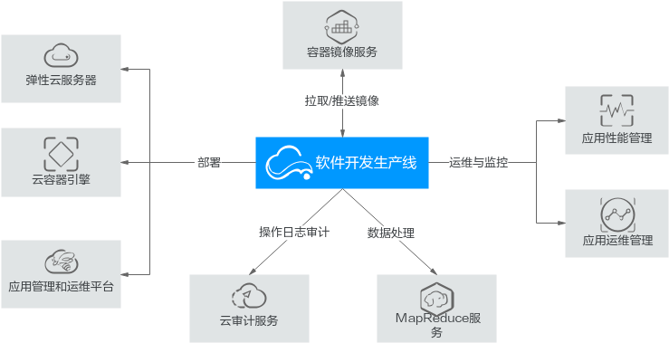

# 云上 DevOps

## DevOps 与基础设施

在云时代，系统的规模快速扩大，而发布周期却越来越短。如何在缩短发布周期的同时提高发布质量，就是摆在技术人面前的一大挑战。为了应对这一挑战，我们就要从多方面、多层次着手。

在方法论层面，敏捷方法已经成为系统建设阶段的默认选择，而 DevOps 方法论则是对敏捷的自然延伸，它把敏捷的思想，延伸到系统运维阶段，侧重于建设工作与运维工作的自然衔接。

DevOps 中存在很多频繁发生且要求高效完成的实践，因此，要让 DevOps 方法论成功落地，就需要进行大量简单重复的劳动，这显然不适合由人来完成。因此，在工具层面，就需要把大量的工作自动化。

同时，DevOps 会持续产出大量的过程数据，这些过程数据如果靠人力进行统计分析会耗费很多精力，时效性也无法保证。因此，在工具层面，就需要能够对这些数据自动进行统计分析和预警。

这些工具，共同构成了 DevOps 的基础设施。DevOps 基础设施的建设殊为不易，它不但要求建设者熟知 DevOps 方法论，而且还要处理很多技术细节。因此，除了一些超大型团队之外，一般都会选择基于现有工具来搭建基础设施。

如果对基础设施的要求不高，而且自身有比较丰富的使用经验，那么建议使用开源技术栈来自行搭建。这样做的首要目的不是为了省钱，实际上，这样做的建设成本可能相当高，因为需要有人去搭建和维护，而这个人往往是比较资深的开发人员。这样做的首要目的是降低学习成本，提高项目启动速度。因为开源技术栈普及率很高，基本上不需要操作培训，只要做一些流程和规范方面的培训就可以了。

如果对基础设施的要求较高或者自身的使用经验不够丰富，那么有两个选择：如果经费充足，可以考虑采购商业产品，如 Jira，这些产品的一体化程度比较高，也有一部分开发人员有使用经验，不过与云平台的整合程度不高；如果经费有限，可以考虑采购云厂商提供的 DevOps 产品，比如使用华为云作为生产环境时，建议选用其配套的 DevOps 平台 CodeArts，也就是以前的 DevCloud。本文就为您介绍一下 CodeArts。

## 试用 CodeArts

毫无疑问，要想了解 CodeArts，最好的方式就是动手试一试，因为站在岸边是学不会游泳的。当然，如果这种尝试能免费那就再好不过了。CodeArts 说，没问题。CodeArts 对 5 人以下团队提供了免费的基础版本，这对于评估、试用、支持小型项目来说已经足够了。这个基础版本的配置单如下：

| 特性   | 容量                                    |
|------|---------------------------------------|
| 需求管理 | 10G存储空间                               |
| 代码托管 | 10G存储空间，单个仓库容量上限2G                    |
| 代码检查 | 每任务最大1个并发                             |
| 流水线  | 每任务最大5个并发                             |
| 编译构建 | 每任务最大5个并发；600分钟构建时长/月                 |
| 部署   | 1个并发                                  |
| 测试管理 | 测试计划和用例管理                             |
| 接口测试 | 5个并发用例；2个并发套件，每套件最大10个并发用例；30分钟测试时长/月 |
| 制品仓库 | 10G存储空间                               |

5 人及以下是免费的，每新增 1 人加收 50 元/月。比自建方案下的建设和运维费用要便宜很多。

如果基础版的配置不满足要求，还可以选择专业版（大中小企业）和铂金版（大型超大型企业），还可以对指定的资源包、特性包进行按需扩容。

## 主要特性

如上一节所示，它的主要特性涵盖了从需求到发布的全部环节。接下来我稍微展开一下讲解：

### 需求管理（CodeArts Req）

本质上是一个以需求为主线串起来的项目管理系统。它是根据华为多年研发实践沉淀出来的需求管理与团队协作服务，内置多种开箱即用的场景化需求模型和对象类型（需求/缺陷/任务等），可支撑IPD、DevOps、精益看板等多种研发模式，还包含跨项目协同、基线与变更管理、自定义报表、Wiki在线协作、文档管理等功能。

除了提供操作指南之外，它还包括对于 Scrum 等敏捷方法的简单介绍，如果你对 Scrum 的了解较少，可以借助它来入门。

### 代码托管（CodeHub）

这是一个面向软件开发者的基于 Git 的在线代码托管服务，类似于 GitHub。具有安全管控、成员/权限管理、分支保护/合并、在线编辑、统计服务等特性，旨在解决软件开发者在跨地域协同、多分支并发、代码版本管理、安全性等方面的问题。

除了提供友好的 UI 之外，它还提供了丰富的对外 API，让你可以通过程序调用它，或者编写脚本来完成批量任务。

### 代码检查（CodeCheck）

这是一个帮你进行代码质量管理的云端服务。软件开发者可在编码完成后执行多语言的代码静态检查和安全检查，获取全面的质量报告，并提供缺陷的改进建议和趋势分析，有效管控代码质量，降低成本。

基于这些质量报告，团队可以修订编程规范以提升代码质量，可以进行缺陷溯源以提升过程质量。还能主动发送通知，以便提醒团队注意特定的问题。

但是要注意，这个特性很容易被管理者滥用。要记住这个工具是用来辅助团队而非约束团队的，应该让团队基于质量承诺来自我设定指标，而不是由管理者强行设定。这些指标更多的是展现团队随时间的纵向变化，通常没有在不同团队之间进行横向比较的价值。

### 编译构建（CloudBuild）

构建是开发过程中必不可少的一个环节，构建速度对于开发效率和开发节奏有着比较明显的影响，在大型项目中尤其如此。

CloudBuild 是一个基于云端大规模并发加速的构建系统，可以为你提供高速、低成本、配置简单的混合语言构建能力，帮你缩短构建时间，提升构建效率。

它支持多种语言，多种框架，覆盖了主流软件开发场景。它会利用云端的海量构建资源，采用多样化的云端构建加速手段，实现本地构建无法企及的构建速度。

它还支持自定义扩展、不同的代码源（也就是不会绑定 CodeHub），让你获得必要的灵活性。

### 部署（CloudDeploy）

它提供了可视化的一键式部署服务，支持部署到虚拟机或者容器，提供 Tomcat、SpringBoot 等模板或者自由组装编排原子步骤进行部署，支持并行部署和流水线无缝集成，实现了部署环境标准化和部署过程自动化。

对于华为云托管的生产服务器，它可以非常简单的实现部署，而对于外部服务器，它也可以在授信后提供比较好的支持。

### 云测（CloudTest）

这是一个一站式云端测试平台，覆盖测试管理、接口测试，融入 DevOps 敏捷测试理念，帮你高效管理测试活动，保障产品的高质量交付。

云测的功能主要包括测试管理和自动化测试两大功能板块。测试管理主要是提供一个宏观视角，了解各项测试的进度和执行状况，而自动化测试则是提供了一系列工具，帮助你对模块、API、UI 等进行自动化测试。

### 制品仓库（CloudArtifact）

制品仓库是软件发布中的一个承上启下的环节，所以在安全、容量等方面都有较高的要求。

CloudArtifact 是一个用来支持软件发布的云服务。它提供了软件仓库、软件发布、发布包下载、发布包元数据管理等功能。通过安全可靠的软件仓库，可以实现软件包版本管理，提升发布质量和效率，实现产品的持续发布。

CloudArtifact 包括成品包和依赖库两大功能板块。前者类似于 Docker Registry，是用来管理最终要部署的软件包的；后者类似于 Maven Repository，是用来管理可复用组件包的，如 Java 的 Library Jar，JavaScript 的 NPM 包等。

### 流水线（CloudPipeline）

这是一个可视化的、可定制的持续交付流水线服务，可以帮助你缩短交付周期，提升交付质量。

和我们常用的 Jenkins 等开源流水线类似，CloudPipeline 也提供了流程编排、权限控制、状态管理、历史管理等功能。不过由于它已经和 CodeArts 的其它部分整合完毕，所以所需要的配置工作量要小一些。

### 移动应用测试（MobileAPPTest）

现在的手机机型越来越多，对于绝大多数团队来说，自备测试机已经不再是现实的选择。但是要想保证用户体验，在多种机型的真机上进行测试却是非常必要的。

这是华为联合 TestBird 提供的移动兼容性测试服务，它覆盖了 98% 主流机型，使用图像识别和精准控件识别技术。你只要提供App应用，就可以生成包含详细兼容性的测试报告（包含系统日志、截图、错误原因、CPU、内存等）。是一种低成本的广谱机型测试技术。

要注意的是，这个服务是由第三方 TestBird 提供的，需要单独计费。

### CloudIDE

这是一项云开发环境服务，类似于 vscode.dev（事实上，CloudIDE 就是在 vscode 的基础上定制的）。开发者只要通过浏览器即可访问云端开发环境，支持编码、调试、运行、预览，还可访问代码仓库和执行命令行，同时支持丰富的插件扩展。

对于熟练使用 vscode 的用户，CloudIDE 可以说没有多少门槛就能用起来。

### 华为开源镜像站（Mirrors）

华为云也加入了开源镜像提供者的行列。这是一个完全免费的福利产品，包括开源组件、开源操作系统及开源DevOps工具的镜像站，致力为用户提供全面、高速、可信的开源组件 / OS / 工具下载服务。这个产品也不限于在华为云内使用，为国内用户提供了一个安全高效的新选择。

按照上面的指南配置即可使用。

## 与其它服务之间的关系

从开发人员的视角来看，CodeArts 是华为云上的一个 DevOps 门户。它可以协调云上的各种资源，可以整合各种系统。帮助你做好开发工作和运维工作，甚至可以打破开发与运维之间的界限（DevOps - 研发运维一体化），避免在协作过程中出现的信息失真，提高协作的效率和质量。

从运维人员的视角来看，研发组织迈向 DevOps 是必然趋势，与其旁观，不如积极参与其中，运维左移，把运维人员的独特经验和视角融入开发过程中，把潜在运维问题消灭在萌芽状态。

## 总结：为何使用 CodeArts

使用 CodeArts 可以让开发者更快地实现 DevOps，而不必自行搭建 DevOps 平台。CodeArts 提供了一系列先进的技术和安全服务，可以帮助开发者更好地管理开发过程，以便快速发布应用。它可以节省大量的时间和精力，是一个非常值得推荐的 DevOps 服务平台。
