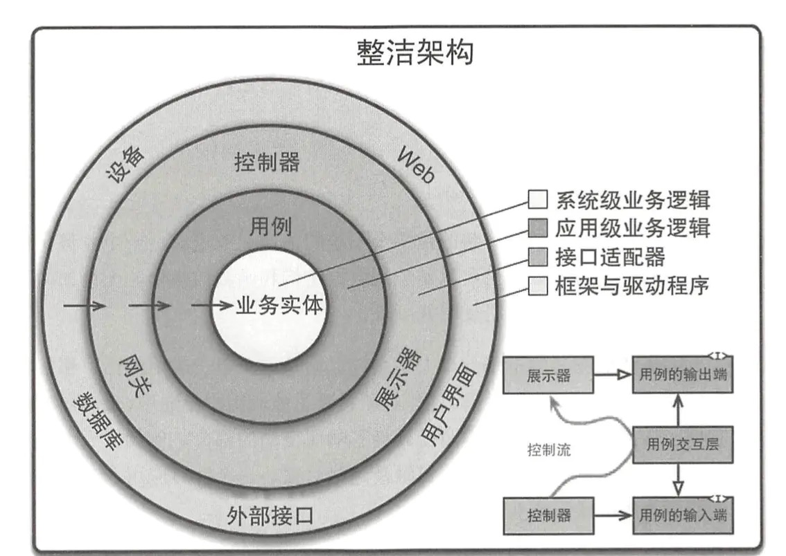

# 一文说透“依赖注入”

## 什么是依赖？

每个软件，都是由很多“组件”构成的。这里的“组件”是指广义的组件 —— 组成部件，它可能是函数，可能是类，可能是包，也可能是微服务。软件的架构，就是组件以及组件之间的关系。而这些组件之间的关系，就是（广义的）依赖关系。

## 依赖有多重要？

软件的维护工作，本质上都是由“变化”引起的，只要软件还活着，我们就无法对抗变化，只能顺应它。而组件之间的依赖关系决定了变化的传导范围。

一般来说，当被依赖的组件变化时，其依赖者也会随之变化。软件开发最怕的就是牵一发而动全身。所幸，并不是每次变化都必然会传导给它的依赖者们。

对于具体实现细节的修改，只要没有改变其外部契约（可简单理解为接口），其依赖者就不需要修改。对于更大规模的修改，比如更换计费策略，我们是不是就无法控制其传播了？也不见得。只要我们的设计能让两者的接口保持一致，就可以把变化控制在尽可能小的范围内。

## 整洁架构与 IoC

对于减少变更传播的方式，Bob 大叔在《架构整洁之道》中做过系统性的阐述，如下图：

在这张图中，我们要注意箭头的指向，箭头的指向就是依赖的方向。我们看到，所有的依赖都指向了用例（领域服务）并最终指向了业务实体。这样的架构很理想，因为业务实体的变化通常都比较少，即使变，通常也是必要的、无法回避的变化。反之，支持新的用户界面、换数据库、换外部系统等方面的变化都只会在很小的范围内传播。回顾一下你维护过的系统的各种变更，都属于哪一类呢？

这张图看起来很美，却和我们传统的编程方式截然不同。以展示器为例，在传统的编程方式下，我们需要在展示器中创建用户界面类的实例，并且设置用户界面的值以及接收来自用户界面的事件。这时候，我们就不得不让展示器“引用”用户界面的类，这样就产生了一个从展示器指向用户界面的依赖，破坏了架构的整洁性。

所以，我们要找到这样一种方式，让展示器能“控制”界面类。更泛化的说法是，让位于架构内层的组件，“控制”位于架构外层的组件，“控制”的方向与“依赖”的方向相反，所以，我们称其为“控制反转”（IoC）。

## 为什么要用依赖注入来管理依赖？

要想解除展示器对界面类的这种错误依赖，我们可以从界面类抽象出一个接口，展示器定义这样一个接口，然后让界面类实现它，这样展示器就不需要再知道界面类的存在了。唯一的问题是：接口本身是抽象的，所以它不能被直接实例化。如果让展示器负责实例化界面类，那么展示器又必须引用界面类了。好吧，一切似乎又回到了原点……不过，我们有另外的办法打破这种僵局。

引入第三方，通常是打破僵局的最佳方式之一。我们需要这样一个第三方：

1. 它既知道如何将界面类实例化，又知道谁要控制这个实例所实现的接口。
1. 它必须是个通用逻辑，也就是说它不应该关心界面类如何实例化的细节，它唯一要了解的信息是界面接口和界面类之间的“实现”关系，以及展示器与界面接口之间的“需要”关系。
1. 它应该超然于整洁架构之外，作为整个架构的大管家，揽下所有“脏活儿”，让架构中的各个组件保持整洁。
1. 展示器通常不用主动找这位大管家，因为大管家能看懂展示器的每一个眼神，展示器只要过“衣来伸手，饭来张口”的生活就可以了。当然，必要时展示器也可以主动跟大管家要这要那，不过，宅是一种幸福，费口舌的事情当然是越少越好。

这种“衣来伸手，饭来张口”的模式就叫做依赖注入，简称 DI。它是实现 IoC 最常见的方式。这个大管家，有个人尽皆知的名片，上面写着几个大字：`Injector`（注入器），当然也有人写得啰嗦一点：`DI Container`（注入容器）。

## 依赖注入实现原理简介

依赖注入的工作逻辑是这样的：

1. 在应用启动时，会把界面类注册到注入器的“提供者映射表”（`界面接口: 界面类`）中，并且以界面接口作为自己的标记（Token）。也就是说把这个界面类注册为这个界面接口的提供者，当需要界面接口的实例时，可以由这个界面类来提供它。
1. 在应用启动时，会把展示器类注册到注入器的“依赖树”（`展示器 ---> 界面接口`）中，表示展示器依赖一个界面接口的实例。如果展示器还依赖其它接口，那就还有更多类似的条目。而界面接口的提供者（界面类）还可能有其自身的依赖，最终形成一棵巨大的树。
1. 当应用开始运行时，展示器会被实例化。注入器在实例化它的时候会发现展示器依赖一个界面接口的实例，于是注入器会尝试在其“实例映射表”（`界面接口：界面接口实例`）中根据这个界面接口查找相应的实例。如果找不到，就会去“提供者映射表”中查找这个界面接口的提供者，这里找到的是界面类。于是，注入器将这个界面类实例化，并将其记入“实例映射表”中，下次就不必再重新初始化它了。如果界面类还有自己的依赖，这个过程就会递归进行。

所以，注入器是这个依赖注入体系中的核心角色，它通过三个内部数据结构：提供者映射表、依赖树、实例映射表来完成整个过程。

但是，往“提供者映射表”中注册的过程该由谁来做呢？如果由界面类或展示器类自己做，那么它们将不得不“引用”注入器，而这不符合注入器的“人设”，理想的注入器应该是默默无闻的，最好让谁都不需要知道它。

那就只能让注入器自行完成这项工作了。

问题在于，注入器要怎么知道哪些类是可注入的呢？所以，我们要让这些可注入的类在实例化之前就具有某些特征，比如静态属性、静态方法，或者注解（Annotation）。

注解是最常见的方式，它像注释一样不被当做代码来执行，而是专门供别人阅读。但注释的读者完全是人类，而注解的主要读者除了人类之外还有框架或预编译器。

启动的时候，注入器会搜集具有指定特征的类，并将其注册到提供者映射表中，并且查找这些类的构造函数或具有某些特征的属性等，分析出其依赖关系，构建出“依赖树”。

## 更多的提供者

在前面的例子中，为了便于理解，我一直用类作为依赖提供者。但实际上，依赖提供者可以有很多形态：常量、变量、函数或者类都是可以的。

我们对依赖提供者唯一的期望是：它能给我们提供一个与特定标记对应的实例。至于这个实例是 `new` 出来的还是调用出来的，我们根本不需要关心。

通过这种面向目标而非面向实现的抽象化设计，我们为应对未来的变化留出了大量的灵活性，却不用付出多少代价。

## 依赖注入的实际应用

控制反转在整洁架构中非常重要，而大部分现代框架的设计思想都是暗合《架构整洁之道》的，因此，在大部分现代框架中，都内置了依赖注入。

最经典、最著名的当属 Spring Framework，可以说依赖注入无处不在。在 Java 后端开发中它几乎一统江湖就是其成功的见证。

在 Android Framework 等移动端框架中，依赖注入也是最常见的框架功能之一。

在前端领域，Angular 从 2009 年的 AngularJS 0.x 开始就支持了依赖注入。到了 Angular 2+ 的时代，借助 TypeScript 的语言特性，它甚至做得比 Spring Framework 还要全面、深入。

## 通过依赖注入改善设计

在面向对象编程的经典著作《设计模式》中，策略模式是使用最广泛的模式之一。但自行实现策略模式很繁琐，也容易出错。而依赖注入是策略模式的最佳实现方式之一。如果我们在设计中使用了策略模式，那么所有繁琐的工作都可以交给依赖注入框架来完成。我们抽象好策略接口，等将来需要换个策略时，只要修改下配置就可以了，而消费方的代码一点都不需要改。

深入理解了依赖注入技术，就可以将其灵活运用在你的各项实际工作中，设计出优美而灵活的应用架构。未来的你，以及接手你工作成果的人，会从你的高质量设计中受益匪浅。
