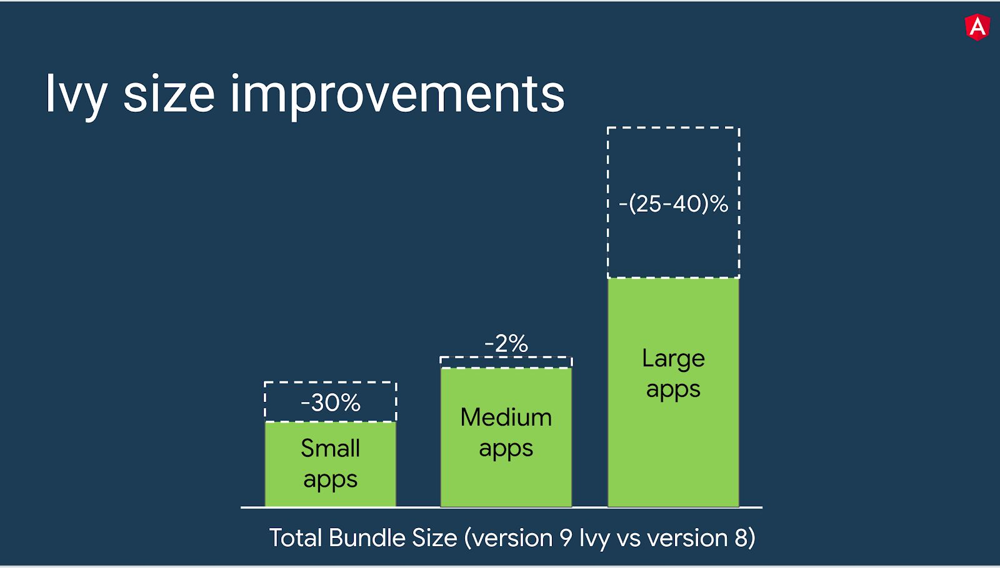
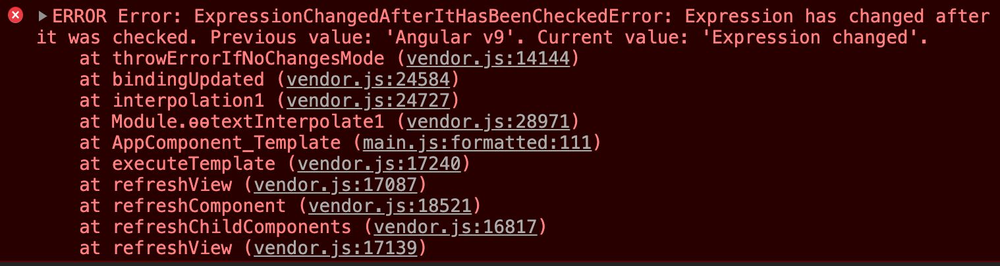
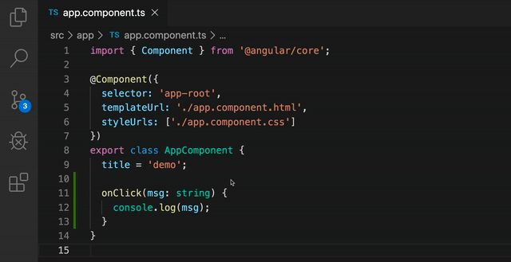

# Version 9 of Angular Now Available — Project Ivy has arrived!

# Angular 9 现已推出 - Ivy 已抵达！

The 9.0.0 release of Angular is here! This is a major release that spans the entire platform, including the framework, Angular Material, and the CLI. This release switches applications to the [Ivy](https://angular.io/guide/ivy) compiler and runtime by default, and introduces improved ways of testing components.

Angular 的 9.0.0 版本发布了！这是一个跨平台的主版本，包括框架、Angular Material 和 CLI。这个版本默认会把应用程序切换到 [Ivy](https://angular.cn/guide/ivy) 编译器和运行时，并改进了组件测试方法。


This is one of the biggest updates to Angular we’ve made in the past 3 years, and we’re excited for all of the ways it empowers developers to build better applications and contribute to the Angular ecosystem.

这是 Angular 在过去 3 年中所做的最重大更新之一，我们很高兴能通过各种方式帮助开发人员构建出更好的应用并为 Angular 生态系统做出贡献。

# How to update to version 9

# 如何更新到版本 9

Visit [update.angular.io](https://update.angular.io) for detailed information and guidance. To have the best update experience, we recommend you first update to the final release of Angular 8.

访问 [update.angular.io](https://update.angular.io)，获取详细信息和升级指导。为了获得最佳的更新体验，我们建议你先升级到 Angular 8 的最终版。

First, update to the latest version of 8

首先，更新到 8 的最新版本

`ng update @angular/cli@8 @angular/core@8`

Then, update to 9

然后，升级到 9

`ng update @angular/cli @angular/core`

To review the key changes with this update, including deprecated APIs, see [Updating to Angular version 9](https://v9.angular.io/guide/updating-to-version-9) in the Angular documentation.

要查看使用此更新内容的关键修改（包括已弃用了哪些 API），请参阅 Angular 文档中的“[更新到 Angular 9](https://angular.cn/guide/updating-to-version-9) ”。

# Ivy

# Ivy（常春藤）

Version 9 moves all applications to use the [Ivy compiler and runtime](https://v9.angular.io/guide/ivy) by default. In addition to hundreds of bug fixes, the Ivy compiler and runtime offers numerous advantages:

默认情况下，版本 9 会把所有的应用程序迁移成使用 [Ivy 编译器和运行时](https://angular.cn/guide/ivy)的。除了数以百计的 bug 修复之外，Ivy 编译器和运行时还提供了许多优点：

* Smaller bundle sizes

  打包尺寸更小

* Faster testing

  测试速度更快

* Better debugging

  更好的调试

* Improved CSS class and style binding

  改进了 CSS 类和样式绑定

* Improved type checking

  改进了类型检查

* Improved build errors

  改进了构建错误

* Improved build times, enabling AOT on by default

  缩短了构建时间，默认启用了 AOT

* Improved Internationalization

  改进了国际化支持

Here’s a breakdown of some of the more notable improvements.

下面是一些比较值得注意的改进项。

# Smaller bundle sizes

# 打包尺寸更小

The Ivy compiler has been designed to remove parts of Angular that aren’t being used via [tree-shaking](https://webpack.js.org/guides/tree-shaking/) and to generate less code for each Angular component.

Ivy 编译器的设计目的是删除那些无法通过[摇树优化](https://webpack.js.org/guides/tree-shaking/)使用的 Angular 部件，并为每个 Angular 组件生成更少的代码。

With these improvements, small apps and large apps can see the most dramatic size savings.

通过这些改进，小型应用和大型应用可以节省大量成本。

* Small apps that don’t use many Angular features can benefit most from tree-shaking.

  那些没用多少 Angular 特性的小应用从摇树优化中受益最多。

* Large apps with many components can benefit most from the reduced factory size.

  包含很多组件的大型应用从减小的工厂函数体积中受益最多。

* Medium-sized apps should see bundle sizes that are on par or slightly smaller, since they benefit less from tree-shaking and don’t have enough components to truly leverage smaller factories.

  中等大小应用的包体积可能只会小一点点，因为它们从摇树优化中受益较少，并且没有足够的组件从减小的工厂函数体积中受益。

<figure>



<figcaption>小型应用程序的发布包体积可减少约 30％，大型应用程序的发布包体积可减少 25–40％，而中型应用程序的发布包受益最少。</figcaption>

</figure>

# Faster testing

# 测试速度更快

We have also revamped the implementation of [`TestBed`](https://angular.io/api/core/testing/TestBed) in Ivy to make it more efficient.

我们还改进了 Ivy 中 [`TestBed`](https://angular.cn/api/core/testing/TestBed) 的实现，以提高效率。

Previously, `TestBed` would recompile all components between the running of each test, regardless of whether there were any changes made to components (for example, through overrides).

以前，`TestBed` 会在运行每个测试之间重新编译所有组件，而不管组件是否有任何变化（例如，通过覆写）。

In Ivy, `TestBed` doesn’t recompile components between tests unless a component has been manually overridden, which allows it to avoid recompilation between the grand majority of tests.

在 Ivy 中，除非已经手动覆盖了一个组件，否则 `TestBed` 不会在这些测试之间重新编译组件，这样就可以避免大多数测试间的重新编译。

With this change, the framework’s core acceptance tests are about 40% faster. We would expect users to see their own application test speeds to be around 40–50% faster.

有了这项更改，框架的核心验收测试速度提高了大约 40％。我们期待用户自己的应用测试速度也能提高 40-50％左右。

# Better debugging

# 更好的调试

Ivy provides you with more tools to debug your applications. When running an application in Dev Mode with the Ivy runtime, we now offer the new `[ng](https://v9.angular.io/api/core/global)` [object for debugging](https://v9.angular.io/api/core/global).

Ivy 为你提供了更多调试应用的工具。当我使用 Ivy 运行时在开发模式下运行应用时，我们现在提供了新的全局对象 [`ng`](https://angular.cn/api/core/global) 来进行调试。

* You can ask Angular for access to instances of your components, directives, and more

  你可以要求 Angular 访问你的组件、指令等实例

* You can manually call methods and update state

  你可以手动调用各个方法并更新状态

* When you want to see the results of change detection, you can trigger change detection with `applyChanges`

  如果要查看变更检测的结果，可以使用 `applyChanges` 来触发变更检测

<figure>


</figure>

Ivy also improves the stack trace for debugging issues such as the `ExpressionChangedAfterItHasBeenCheckedError`. Previously the stack trace could be unhelpful:

Ivy 还改进了用于调试问题的调用栈跟踪，比如 `ExpressionChangedAfterItHasBeenCheckedError` 。以前堆栈跟踪可能没多少帮助：

<figure>


</figure>

With Ivy, you see a more useful stack trace that allows you to jump directly to the template instruction with the expression that has changed.

在 Ivy 中，你可以看到一个更实用的调用栈跟踪，它允许你直接从一个已更改的表达式跳转到模板指令。

<figure>



</figure>

For example, if you click on `AppComponent_Template` in the stack trace above, you can see the specific line in the generated code where the error is being thrown:

例如，如果在上面的堆栈跟踪中单击 `AppComponent_Template`，就可以在生成的代码中看到抛出该错误的具体代码行：

<figure>


</figure>

If you’re so inclined, you can also step into any of these framework instructions to walk through how the framework creates or updates your components.

如果愿意，你还可以进入任何一个框架指令，来了解框架是如何创建或更新你的组件的。

# Improved CSS class and style binding

# 改进了 CSS 类和样式绑定

The Ivy compiler and runtime provides improvements for handling styles. Previously, if an application contained competing definitions for a style, those styles would destructively replace each other. With Ivy, the styles are merged in a predictable way.

Ivy 编译器和运行时改进了处理样式的方式。以前，如果一个应用程序包含了对某种样式的竞争性定义，那些样式就会破坏性地相互覆盖。在 Ivy 中，样式将以可预测的方式合并在一起。

Consider the following template and component snippets:

考虑下面的模板和组件片段：

```html
<my-component style="color:red;" [style.color]="myColor" [style]="{color: myOtherColor}" myDirective></div>
```

```typescript
@Component({
  host: {
    style: "color:blue"
  },...
})
...

@Directive({
  host: {
    style: "color:black",
    "[style.color]": "property"
  },...
})
...
```

Previously, whichever binding was evaluated last would win, and this could depend on the timing of changes to these expressions. If `myColor` and `myOtherColor` both were undefined, the static ‘red’ style would be ignored.

以前，被最后计算出的那种绑定会胜出，而这可能取决于对这些表达式的修改时机。而如果 `myColor` 和 `myOtherColor` 都是未定义的，静态的'red'样式就会被忽略。

With version 9, you can manage your styles through a clear, consistent order of precedence that isn’t dependent on timing. The most specific styles always have the highest precedence. For example, a binding to `[style.color]` overrides a conflicting binding to `[style]`.

在版本 9 中，你可以通过一个清晰、一致的优先顺序来管理你的样式，而这些顺序与时间无关。最具体的样式始终具有最高的优先级。例如，对 `[style.color]` 的绑定会覆盖 `[style]` 中的同名绑定。

However, for backwards compatibility reasons, we have left `[ngStyle]` and `[ngClass]` bindings behavior the same as before. When their binding values are updated, the new values will override any competing bindings.

但是，出于向后兼容性的考虑，我们仍然把 `[ngStyle]` 和 `[ngClass]` 的绑定行为保持原样。也就是说，它们的绑定值发生变化时，新值会覆盖任何竞争性绑定。

You can read more about styling precedence rules in the [Template Syntax guide](https://v9.angular.io/guide/template-syntax#styling-precedence) in the documentation.

你可以在文档中的[模板语法](https://angular.cn/guide/template-syntax#styling-precedence)一章阅读更多关于样式优先级规则的内容。

As a side effect of the styling refactoring, you can now also bind to [CSS custom properties](https://developer.mozilla.org/en-US/docs/Web/CSS/Using_CSS_custom_properties) (also known as CSS variables).

作为样式重构的一个额外收获，你现在也可以绑定 [CSS 自定义属性](https://developer.mozilla.org/en-US/docs/Web/CSS/Using_CSS_custom_properties)（也叫 CSS 变量）了。

```html
<div [style. -- main-border-color]=" '#CCC' ">
<p style="border: 1px solid var(--main-border-color)">hi</p>
</div>
```

# Improved type checking

# 改进了类型检查

The Angular compiler can check more of the types of your application, and it can apply more strict rules. These features will help you and your team catch bugs earlier in the development process.

Angular 编译器可以检查应用中的更多类型，还可以应用更严格的规则。这些特性可以帮助你和你的团队在开发过程的早期阶段发现 bug。

We support two main flags for additional type checks in addition to the default.:

除默认值外，我们还支持两个主要的标志来进行额外的类型检查：

* `fullTemplateTypeCheck` — Activating this flag tells the compiler to check everything within your template (`ngIf`, `ngFor`, `ng-template`, etc)

  `fullTemplateTypeCheck` - 激活这个标志会告诉编译器要检查你模板中的所有内容（ `ngIf` ， `ngFor` ， `ng-template` 等）

* `strictTemplates` — Activating this flag will apply the strictest Type System rules for type checking.

  `strictTemplates` - 激活这个标志会在类型检查中使用最严格的类型系统规则。

To learn more about template type checking options, see the [Template type checking guide](https://v9.angular.io/guide/template-typecheck) in the documentation.

要了解有关模板类型检查选项的更多信息，请参阅文档中的[模板类型检查指南](https://angular.cn/guide/template-typecheck) 。

# Improved build errors

# 改进了构建错误

The new Ivy compiler is not only faster and offers stronger type safety, it also makes all of the error messages easier to read.

新的 Ivy 编译器不仅运行速度更快、有更强大的类型安全性，而且还能让所有的错误信息更容易阅读。

In version 8 or View Engine, a typical compiler error would look like the following:

在版本 8 或 View Engine 中，典型的编译器错误如下所示：


In version 9 with Ivy, the same error looks like:

在使用 Ivy 的 9 版本中，同样的错误如下：


# Improved build times, enabling Ahead-of-Time compiler on by default

# 缩短了构建时间，默认启用了预先编译器（AOT）

Thanks to Ivy’s new architecture, we’ve made significant improvements to the compiler’s performance.

感谢 Ivy 的新架构，我们对编译器的性能做了很大的改进。

We measure our compiler’s performance in terms of the *overhead* on top of a plain TypeScript compilation of an application. For our documentation app (angular.io), this overhead decreased from 0.8x to 0.5x with Ivy, an improvement of nearly 40%.

我们会根据应用中普通的 TypeScript 编译*开销*来衡量编译器的性能。对于我们的文档应用（angular.io）来说，使用 Ivy 时，这个开销从 0.8 倍减少到了 0.5 倍，提升了近 40％。

These improvements mean that [AOT builds](https://angular.io/guide/aot-compiler) can be noticeably faster. Thanks to this speedup, for the first time ever we’re using AOT even for dev-mode builds. This means that `ng serve` now benefits from the same compile-time checking as production builds, significantly improving the developer experience for Angular.

这些改进意味着 [AOT 构建](https://angular.cn/guide/aot-compiler)的速度可以显著加快。感谢这次加速，我们第一次在开发模式下使用 AOT。这意味着 `ng serve` 现在可以从与构建时相同的编译期检查中获益，从而大大提高了 Angular 的开发体验。

Thanks to the changes in the compiler and runtime, we also no longer require `[entryComponents](https://v9.angular.io/guide/deprecations#entryComponents)`. These components will be discovered and compiled automatically by their usage.

由于编译器和运行时都发生了变化，我们也不再需要 `[entryComponents](https://angular.cn/guide/deprecations#entryComponents)` 。这些组件全都会根据用途被自动发现和编译。

# Improved internationalization (i18n)

# 改进了国际化支持（i18n）

Internationalization has been a core feature of Angular, where you could build your application once per locale and receive highly optimized and localized applications. In 9.0, we’re making this faster by moving the build-time i18n substitutions later in the build process. This change allowed us to make it up to 10 times faster.

国际化已经成为 Angular 的核心特性，你可以在每个语言环境中构建一次应用，并收获高度优化的本地化应用。在 9.0 中，我们通过把 i18n 的工作移到构建过程的后期实现了这一目标。这种变化让我们能把它提速 10 倍。

[Read more](https://v9.angular.io/guide/i18n) about the new i18n: `@angular/localize` and the new `angular.json` configuration.

[阅读更多](https://angular.cn/guide/i18n) 以了解关于新 i18n 中 `@angular/localize` 和新的 `angular.json` 配置的信息。

# Other improvements with version 9

# 版本 9 还有其它一些改进

The team has also been hard at work continuing to improve the full experience of using Angular.

该团队还努力工作，不断提升使用 Angular 的全部体验。

# More reliable ng update

# 更可靠的 ng update

We’ve made some changes to how `ng update` works to make it more reliable and informative.

我们对 `ng update` 工作方式进行了一些修改，以提高它的可靠性和信息量。

* **Always use the latest CLI.** Starting with 8.3.19 of the CLI, we now use the CLI from the update TARGET version during updates. This means that, going forward, updates will always be handled by the latest CLI automatically.

  **始终使用最新的 CLI**。从 CLI 的 8.3.19 版本开始，我们现在在升级过程中使用了 TARGET 版本的 CLI。这意味着，在未来，更新将始终由最新的 CLI 自动处理。

* **Clearer progress updates.** `ng update` now does more to tell you what is going on under the hood. For each migration, you’ll see information about the migration.

  **进度更新更清晰**。`ng update` 现在做了更多的工作来告诉你幕后的情况。对于每次迁移，你都会看到迁移中的更多信息。

* **Easier update debugging.** By default, `ng update` runs all of the migrations and leaves the aggregate changes on disk for you to inspect. The version 9 update also introduces the new `**--create-commits**` flag. When you run `ng update --create-commits`, the tool commits the state of your codebase after each migration, so you can step through and understand or debug the changes we are making to your code.

  **更容易对更新进行调试**。 默认情况下，`ng update` 运行所有迁移，并在磁盘上留下最终结果更改供你检查。版本 9 的更新还引入了新的 **`--create-commits`** 标志。当你运行 `ng update --create-commits` 时，该工具会在每个迁移动作后提交代码库的状态，这样你就可以逐步理解或调试我们对代码所做的更改。

# New options for _`providedIn`

# _`providedIn`_ 的新选项

When you create an `@Injectable` service in Angular, you must choose where it should be added to the injector. In addition to the previous `root` and module options, you have two additional options.

当你在 Angular 中创建一个 `@Injectable` 服务时，你必须选择它应该添加到注入器的什么位置。除了以前的 `root` 和模块这两种选项之外，还有两个新选项。

* `platform` — Specifying `providedIn: 'platform'` makes the service available in a special singleton platform injector that is shared by all applications on the page.

  `platform` - 指定 `providedIn: 'platform'` 可以在一个特殊的单例平台注入器中使用该服务，该注入器由该页面上的所有应用共享。

* `any`— Provides a unique instance in every module (including lazy modules) that injects the token.

  `any` - 在每个注入该令牌的模块（包括惰性加载模块）中提供一个唯一的实例。

[Learn more about providedIn](https://v9.angular.io/api/core/Injectable) in our API documentation.

请到我们的 API 文档中[了解详情](https://angular.cn/api/core/Injectable) 。

# Component harnesses

# 组件的测试挽具

Testing components has historically relied on using implementation details such as CSS selectors to find components and to trigger events. This meant that whenever a component library changed its implementation, all of the tests relying on those components would need to be updated.

历史上，测试组件一直靠 CSS 选择器这样的实现细节来查找组件和触发事件。这意味着只要组件库改变了它的实现，就需要更新依赖这些组件的所有测试。

In version 9, we are introducing *component harnesses*, which offer an alternative way to test components. By abstracting away the implementation details, you can make sure your unit tests are correctly scoped and less brittle.

在版本 9 中，我们引入了*组件的测试挽具*，它提供了另一种测试组件的方法。通过抽象出实现细节，你可以确保你的单元测试被正确的局部化，而且不那么脆弱。

Most of Angular Material’s components can now be tested via harnesses, and we are making harnesses available to any component author as part of the [Component Dev Kit](https://material.angular.io/cdk/categories) (CDK).

现在，Angular Material 的大多数组件都可以通过这些挽具进行测试，而且我们还会把这些挽具作为[组件开发套件](https://material.angular.cn/cdk/categories) （CDK）的一部分提供给任何一位组件作者。

Here’s an example test before harnesses:

这是一个在使用组件挽具之前的一个测试范例：

```typescript
it("should switch to bug report template", async () => {
  expect(fixture.debugElement.query("bug-report-form")).toBeNull();
  const selectTrigger = fixture.debugElement.query(
    By.css(".mat-select-trigger")
  );
  selectTrigger.triggerEventHandler("click", {});
  fixture.detectChanges();
  await fixture.whenStable();
  const options = document.querySelectorAll(".mat-select-panel mat-option");
  options[1].click(); // Click the second option, "Bug".
  fixture.detectChanges();
  await fixture.whenStable();
  expect(fixture.debugElement.query("bug-report-form")).not.toBeNull();
});
```

And the same test with harnesses:

而用组件挽具做同样的测试如下：

```typescript
it("should switch to bug report template", async () => {
  expect(fixture.debugElement.query("bug-report-form")).toBeNull();
  const select = await loader.getHarness(MatSelect);
  await select.clickOptions({ text: "Bug" });
  expect(fixture.debugElement.query("bug-report-form")).not.toBeNull();
});
```

Learn more about [Material’s component harnesses](https://v9.material.angular.io/guide/using-component-harnesses) or [building your own](https://v9.material.angular.io/cdk/testing/overview) with the CDK.

了解更多关于 [Material 的组件测试挽具](https://v9.material.angular.cn/guide/using-component-harnesses)或用 CDK [构建你自己的挽具](https://v9.material.angular.io/cdk/testing/overview)。

# New components

# 新的组件

You can now include capabilities from YouTube and Google Maps in your applications.

你现在可以在应用中添加来自 YouTube 和谷歌地图的功能了。

* You can render a YouTube Player inline within your application with the new [youtube-player](https://github.com/angular/components/tree/master/src/youtube-player). After you load the YouTube IFrame player API, this component will take advantage of it.

  你可以使用全新的 [youtube-player](https://github.com/angular/components/tree/master/src/youtube-player) ，在你的应用中内嵌 YouTube 播放器。当你加载了 YouTube 的 IFrame 播放器 API 之后，这个组件就会利用它。

* We are also introducing [google-maps](https://github.com/angular/components/tree/master/src/google-maps) components. These components make it easy to render Google Maps, display markers, and wire up interactivity in a way that works like a normal Angular component, saving you from needing to learn the full [Google Maps API](https://developers.google.com/maps/documentation/javascript/tutorial).

  我们还推出了 [google-maps](https://github.com/angular/components/tree/master/src/google-maps) 组件。利用这些组件，你可以轻松地渲染谷歌地图，显示地标，并像普通的 Angular 组件一样与其交互，让你无需学习完整的 [Google Maps API](https://developers.google.com/maps/documentation/javascript/tutorial) 即可使用。

# IDE & language service improvements

# IDE 和语言服务改进

<figure>



<figcaption>转到定义（Go to definition）和改进的语言服务演示</figcaption>

</figure>

Significant improvements have been made to the Angular language service [extension](https://marketplace.visualstudio.com/items?itemName=Angular.ng-template) on the Visual Studio Marketplace. Along with major architectural overhaul to address performance and stability issues, many long-standing bugs have also been fixed. Besides that, some new features include:

Visual Studio Marketplace 上的 Angular 语言服务[扩展](https://marketplace.visualstudio.com/items?itemName=Angular.ng-template)已做了重大改进。随着对性能和稳定性问题的重大架构变革，许多长期存在的漏洞也得到了修复。还包括一些新特性：

* TextMate grammar for Angular Template Syntax, which now enables syntax highlighting in both inline and external templates

  Angular 模板语法的 TextMate 语法定义，现在可以在内联和外部模板中启用语法高亮显示了

* “Go to definition” for `templateUrl` and `styleUrls`

  针对 `templateUrl` 和 `styleUrls` 的“转到定义”功能

* NgModule and type information in hover tooltip

  悬浮工具提示中的 NgModule 和类型信息

# TypeScript 3.7 support

# TypeScript 3.7 支持

Angular has been updated to work with TypeScript 3.6 and 3.7, including the extremely popular [optional chaining](https://developer.mozilla.org/en-US/docs/Web/JavaScript/Reference/Operators/Optional_chaining) feature in TypeScript 3.7. To stay in sync with the ecosystem, we’ve also updated our version of other ecosystem dependencies such as Zone.JS and RxJS.

Angular 已经更新，可以用 TypeScript 3.6 和 3.7 了，也包括 TypeScript 3.7 中非常受欢迎的[可选串联（optional chaining）](https://developer.mozilla.org/en-US/docs/Web/JavaScript/Reference/Operators/Optional_chaining)特性。为了与生态系统保持同步，我们还更新了其他生态系统依赖的版本，比如 Zone.JS 和 RxJS。

# Thank you to the community

# 谢谢社区

This release is the culmination of over 2 years of work. We’re really excited about the future and possibilities that this work opens up. This wouldn’t be possible without the work of hundreds of people in the community.

这个版本是两年多来工作的结晶。我们对这项工作的未来及其无限可能感到非常兴奋。如果没有社区数百人的努力，这是不可能实现的。

v9 Contributors:

v9 贡献者：

Aaron Frost, Adam J. Penn, Adam Plumer, Adam Vigneaux, Adrien Crivelli, Ajit Singh, Alain Chautard, Alan Agius, Alexander Ivanov, Alexander von Weiss, Alex Eagle, Alex Rickabaugh, alexzuza, Ali Mirlou, Alison Gale, Alyssa Nicoll, Amadou Sall, AMarinov, Amit Dubey, Anders Kjær Damgaard, Andrew Kushnir, Andrew Scott, Andrew Seguin, Andrius, Andrus Diaz, Ankit Prajapati, Aravind, Aristeidis Bampakos, Arne Hoek, Artur Androsovych, arturovt, Atef Ben Ali, Ayaz Hafiz, Ben Elliott, Benjamin Liii, Brian Michalski, CaerusKaru, Carlos Ortiz García, Cédric Exbrayat, Charles Lyding, Christian Liebel, Christopher Dahm, codingnuclei, Colum Ferry, Craig Spence, cran-cg, crisbeto, Cyrille Tuzi, Daniele Morosinotto, Daniel Waxweiler, Danny Skoog, David Sánchez, David Shevitz, Denis Omelkov, Denys Vuika, Diego Juliao, dishanfernando, Dmitri Ischenko, Dominik Pieper, Do Nhu Vy, Doug Parker, Dyma, EddyP23, Edy Segura, Eliran Eliassy, Elvis Begovic, Emmanuel DEMEY, Ephraim, Erik Pintar, Esteban Gehring, Eusen, Evan Martin, FabianGosebrink, FaustmannChr, FDIM, Ferdinand Malcher, FG-33, Filipe Silva, Gabor Szekely, Gabriel Medeiros Coelho, GavinMK, Geoff Bass, George Kalpakas, Gérôme Grignon, ghiscoding, Girma Nigusse, Greg Magolan, Grigoriy Beziuk, hafiz, Harinder Singh, Hayouung, Hoel IRIS, horn, idzark, Igor Minar, Issei Horie, ivanwonder, Jakub Pawlot, James Vickery, Jan Malchert, Jason Bedard, Jeff Held, Jennifer Fell, Jeremy Elbourn, JiaLiPassion, Jithil P Ponnan, jnavb, Joakim Zebic, Joey Perrott, john li, John Ralph Umandal, Jonathan Sharpe, Joost Koehoorn, Jordan Amman, Jordan Nelson, Joshua Colvin, Judy Bogart, J Z, Kai Röder, Kapunahele Wong, Kara Erickson, katryo, Kayla Altepeter, Keen Yee Liau, ketangote, Kirk Larkin, Koala, Kristina Gocheva, kristinavavrova, Kristiyan Kostadinov, Kwinten Pisman, Kyle J. Kemp, Lars Gyrup Brink Nielsen, LASLEDJ, lazarljubenovic, Leonardo Zizzamia, Leon Radley, Luka Petrovic, Mansour Fall, manzonif, Mark Goho, Martina Kraus, Martin Probst, Matias Niemelä, Matthew Harris, Matt Janssen, Mayur Barge, mbehrlich, mertdeg2, Michael Maier, Michael Nahkies, Michael Prentice, Michał Koziara, Mike Brocchi, Mike Casebolt, mikef, Miles Malerba, Minko Gechev, Mirco Widmer, Misko Hevery, Miško Hevery, Mitchell Skaggs, mohax, Muhammad Umair, Muhammad Umair Khan, Nathan Tate, Németh Tamás, Nicolas Villanueva, Nikita Potapenko, Niklas Merz, noeri, Noopur, NothingEverHappens, ODAVING, Olegas Goncarovas, Olivier Combe, Orlando Pozo, owenmecham, Pascal Fivian, paulceli, Paul Gschwendtner, Pawel Kozlowski, Pete Bacon Darwin, Phaneendra, philonor, Pierre-Yves FARE, Piotr Błażejewicz, Potapy4, Rado Kirov, Ralf D. Müller, Raz Luvaton, Reuben Wilson, Richard Lea, Rick Katka, Robert Coie, Robin Dupret, Roy, Rudar Daman Singla, Rustam, Sachin, Sahan Serasinghe, Sam Julien, Santosh Yadav, Sasha Rudan, Sergey Koshechkin, Sergey Nikitin, Shibasish, Sholka Jadav, Showtim3, ShubhrankR, Simon Jespersen, Simon Kurtz, skrikl, Smartin, Sonu Kapoor, Srichandradeep Choudarapu, Sriram Jayarman, Stefanie Fluin, Stephen Cooper, Stephen Fluin, Suguru Inatomi, Suresh918, Syu Kato, thanhpd, thekiba, TheMushr00m, Tiep Phan, Timar, Tim Deschryver, TinyMan, Tom Kwong, Tom Sullivan, Trevor Karjanis, Troels Lenda, Turtuvshin Byambaa, Vanessa Schmitt, Victor, Vikash Dahiya, Vikram Subramanian, Wagner Maciel, Wataru Kasahara, Wenqi, why520crazy, willbeaufoy, William Lohan, WreckItRalph, Yann Bertrand, Younes Jaaidi, Yulia Tsareva, Zaid Al-Omari, zuckjet, 陈旭.

We would also like to thank our GDEs and the community at large. The feedback, issue reports, and reproductions we receive are essential to holding our work to the highest quality standards. There are already over 4000 public Angular apps using version 9.

我们还要感谢我们的 GDE 和整个社区。我们收到的反馈、问题报告和问题重现项目（Reproductions）对于让我们的工作达到最高质量标准至关重要。使用版本 9 的公开 Angular 应用已经超过了 4000 个。

Special thanks to our long term enterprise collaborator [Pawel Kozlowski](https://github.com/pkozlowski-opensource) and his sponsor [Amadeus](https://amadeus.com/). Pawel made a huge quantity of contributions with exceptional quality over the 2 years of the Ivy project that have been a critical part of the project’s success.

特别要感谢我们的长期企业合作伙伴 [Pawel Kozlowski](https://github.com/pkozlowski-opensource) 和他的赞助商 [Amadeus](https://amadeus.com/)。在 Ivy 项目的两年时间里，Pawel 以极高的品质做出了巨大的贡献，这是该项目成功的关键部分。

If you have feedback on this release, please [file an issue](https://github.com/angular/angular/issues/new/choose), or [let us know](https://twitter.com/angular)!

如果您对本次发布有任何意见和建议，请[提出 Issue](https://github.com/angular/angular/issues/new/choose) ，或者[告诉我们](https://twitter.com/angular) ！
