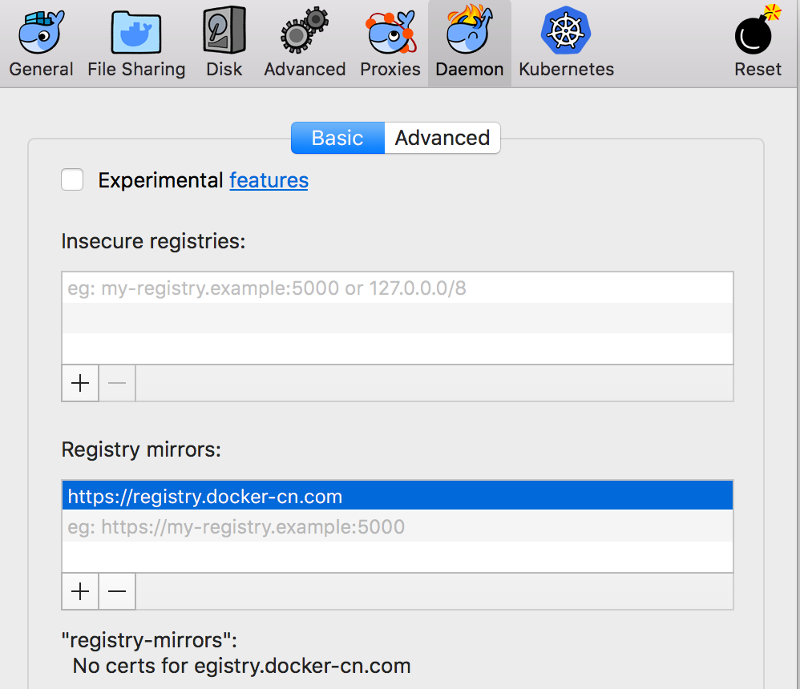

# 开发人员要掌握的十八条 Docker 知识

## 为什么说 Docker 是轻量级虚拟技术？

虚拟技术按照重量级大致可分为如下几种（从重到轻）：

1. 硬件仿真

   典型的有 QEMU 、Android 模拟器以及各种街机模拟器。它们会在宿主机上运行一个 CPU 指令的解释器，因此可以运行不同 CPU 指令集下的应用。硬件仿真方式的额外运行开销极大，限制了其应用场景，但是只是有些场景下只有这种方式可以解决。

1. 设备虚拟化

   典型的有 VMWare Workstation、Virtual Box 等。与硬件仿真不同，它们只负责把客户机对设备的请求，转发给宿主机，因此无法跨 CPU 指令集。相应的，其额外开销也小得多。根据是否需要修改宿主操作系统以配合客户机，它又可分为全虚拟化和半虚拟化。

1. 容器技术

   典型的有 Docker、LXD 等。它们的内核都是 LXC，这是 Linux 操作系统提供的容器化技术，它不会虚拟化任何设备，只会利用命名空间对系统资源进行隔离。显然，这种方式的开销是极小的，和原生应用几乎没有差别。
   
   这样一来，每个容器中的进程都只能访问所属命名空间中的资源，不同容器中的资源彼此独立，它们可以使用相同的端口、文件名而不会互相干扰。这种特性，让应用在部署时不需要考虑所在的环境，从而显著简化了运维工作。这促成了 Docker 的流行。
   
   值得注意的是，Docker 自己实现了一个特殊的文件系统，这个文件系统的思维模型类似于 Git 或 CSS，其最终结果是由一系列单层镜像叠加而成的。镜像（image）中包含的层都是只读的，而容器（container）则会在镜像层之上叠加一个读写层，所有你在容器中进行的修改都会保存在读写层中。当你用 `docker commit` 命令提交这个容器时，这个读写层就会变成只读层，并连同其基础镜像的只读层一起变成一个新的镜像。
   
   先对这个文件系统有个印象，后面的很多内容都与此相关。

1. 专用子系统

   典型的是 Windows 10 下的 WSL，它可以让你在 Windows 上运行绝大多数 Linux 程序。事实上，Windows 10 中和我们打交道的那部分叫做 "Win32 子系统"，而 WSL 的全称则是 "Windows Subsystem for Linux"。顾名思义，WSL 是个跟 "Win32 子系统" 平等的专用 API 层。在这种模式下 WSL 中的文件、端口等资源都是共享的，因为这些都是属于 Windows 内核的一部分，而 Win32 子系统和 WSL 子系统都共享同一个内核。

   从性能的角度看，它就是原生应用，甚至连命名空间隔离、虚拟文件系统之类的逻辑都不需要。虽然如此，它和容器技术在性能上其实没有多少可感知的差异。

## 请用 docker-cn.com

当你在国内使用 docker 时，是否觉得下载太慢了？是否试过代理、VPN 等方式都没能解决？现在，你可以一劳永逸的解决这个问题了，Docker 官方专门为中国区提供了一个镜像站 `https://registry.docker-cn.com`。

在 Linux 下，要编辑 `/etc/docker/daemon.json` 文件（在 Mac 下位于 `~/.docker/daemon.json`），并添加如下语句：

```
{
  "registry-mirrors": ["https://registry.docker-cn.com"]
}
```

同时，在 Mac/Windows 下，你还可以通过图形界面进行配置：



## 搭建 docker 私服

如果你有一些私有镜像需要发布到 Registry 中，那么可以使用私服。在 AWS、Azure、GCE 和阿里云平台上，都提供了免费的 Docker Registry 服务。

如果你的开发环境可以访问外网，并且安全管理政策允许，那么使用这些私服是省心省力省钱的事情，建议优先选用。如果受限，那么也可以自己搭建一个 Docker 私服。

Docker 官方提供了一个镜像 `registry` ，可用来搭建 Docker 私服，不过这是个社区版的私服，不支持登录认证（企业版功能），所以，如果要使用它，你就要确保它只能被可信的客户端访问到。

不过，你还可以用 Sonatype Nexus 来代替它，以支持登录认证。事实上，Nexus 几乎支持开发时所需的各种私服。

## 小心！没有 dockerfile 的第三方镜像可能引狼入室！

当你从 `hub.docker.com` 查找镜像时，请务必小心那些没有提供 Dockerfile 的第三方镜像。那样的 docker 镜像是一个黑箱，你无法了解它里面到底做了什么。镜像的作者在本机做好镜像之后，再整体推送上去，docker 服务器只负责存储。这就意味着，作者可以轻易在里面放一个木马，而你几乎永远无法发现。

而那些提供了 Dockerfile 的镜像，则是在 Docker 服务器上自动编译出来的。因此它做了什么完全取决于 Dockerfile 中的命令，你可以审核这个 Dockerfile，检查它有没有执行恶意操作。当然，对于那种直接从远端服务器下载一个文件的 Dockerfile，你还要检查这个远端服务器的可信度。

如果你要把镜像交付给客户，那么更专业的做法是提交一个能编译成镜像的 Dockerfile 及其相关文件，而不要提交黑箱式的镜像，以便让客户安心。

## 没有私服怎么办？

在不同安全等级的网络环境下，可能无法建立一个双方可达的私服。这时候，你可以用 U 盘来传输一个镜像。

要想用 U 盘传输镜像，你首先要使用 `docker save <镜像名> -o <文件名>` 命令把源环境下的一个镜像保存成文件，然后把它复制到目标环境下，并在目标环境下运行 `docker load -i <文件名>`，把它装载进来。

类似的，你还可以用 `docker export <容器名> -o <文件名>` 命令来把容器导出成文件，再用 `docker import <文件名>` 命令来把文件导入成一个镜像（注意，不是容器），然后你可以把它作为基础镜像运行起来，重新变成一个容器。

## 容器ID、容器名称、容器改名（`docker rename`）

每个容器都有一个唯一的 ID，你对该容器的所有操作都可以使用这个 ID 进行。它是一个用于表示 32 字节数据的十六进制字符串。当然，这样长的 id 实在很不方便，所以在 docker 中常用的是它的前 6 字节的十六进制形式。事实上，只有确保不会混淆，你就算只用一个字节来代替它都可以。

除了长度问题之外，容器 ID 的主要问题是可读性太差了，因此 docker 还允许你为容器指定一个有意义的名字，凡是需要容器 ID 的地方，都可以同样用容器名称代替。你只要用 `docker run --name <容器名称>` 来指定它就可以了。

如果你启动的时候忘了指定容器名或者指定了不恰当的容器名，该怎么办呢？别担心，还有办法补救。

你可以用 `docker rename <现有容器 ID 或容器名称> <新容器名称>` 来对现有容器进行改名。

## 文件映射(`docker run -v`)与端口映射(`docker run -p`)

虽然每个容器的文件和网络端口都是独立的，但如果我们要使用它就难免让它和宿主机上的文件和网络端口打交道，否则就没什么用处。在容器和宿主机之间建立联系的方式，叫做映射。

要想建立映射，就要使用 `docker run` 命令中的参数来指定这种映射关系。

要想指定文件/目录映射，请使用 `-v <宿主路径>:<容器路径>[:ro]` 参数，其中 `v` 是 `volume` 的缩写，也就是文件系统中的"卷"。如果带上了 `:ro` 部分，则这个卷将加载为只读（readonly）模式，如果你想把宿主机上的文件只读共享给容器，那么加上这个标志可以防止你的文件被意外破坏。

要想指定端口映射，请使用 `-p <宿主端口>:<容器端口>` 参数。注意，这里的 `p` 不是 `port` 的缩写，而是 `publish` 的缩写，意思是你想往宿主机的一个端口上发布容器中的某个端口。其顺序和文件映射一样，总是在前宿主，容器在后 —— 这容器还是蛮客气的嘛。 

如果要把容器中的端口全都发布出来，可以用 `-P` 参数，注意这里的 `P` 是大写，这个参数的全称是 `--publish-all`。

无论是文件映射还是端口映射，都可以指定多个参数，来分别映射不同的路径或端口。比如 `-p 80:80 -p 443:443`。

## 后台运行（`docker run -d`）

人们把很多服务都做成了镜像，如果直接启动它们，就会阻塞当前进程，但实际上它们都是设计成以后台服务的形式运行的。这时候，你就可以用 `-d` 参数，来让它们与当前进程分离（`detach`），并转入后台运行模式。

## 交互模式(`docker run -i`)与 tty(`docker run -t`)

有些镜像的主要设计目的是作为交互式的命令终端，如 `ubuntu`、`busybox` 等。它们的默认命令是 `sh`/`bash` 等，当标准输入设备（`stdin`）处于关闭状态时这些命令就会退出。

要想让 `stdin` 在启动时处于打开状态，就要加上 `-i`（`--interactive`）参数，表明你要跟它进行交互。

比如 `echo 'ls' | docker run ubuntu` 将会直接退出，不给出任何输出，而 `echo 'ls' | docker run -i ubuntu` 则会正确地列出容器中的目录。

该特性可以让你把这些容器无缝的编排进脚本中。

如果你想进入容器的控制台，以便自己能手动敲命令，那么就要通过 `-t`（`--tty`） 参数来让 docker 模拟出一个 tty（电传打字机的缩写，现代一般指键盘）。有了 tty，docker 才能从宿主机的键盘上接收输入。由于控制台只有在交互模式下才有意义，因此通常会和 `-i` 联用，并简写为 `-it` 参数。

下列命令也能达到和 `-it` 类似的效果，作为思考题，请分析下这是为什么：

`cat | docker run -i ubuntu`，然后你就可以在控制台中敲 `ls` 等命令，并看到结果。

## 建立临时容器(`docker run --rm`)

如果你启动一个 ubuntu 容器，并在其中执行一些命令后退出，再执行 `docker ps -a` 命令列出所有容器，就会发现刚才退出的那个容器仍然存在，只是变成了非运行状态。它仍然占用着刚才分配的磁盘空间（容器文件系统中的读写层）。虽然这种特性有时候很有用，但长此以往，你的磁盘空间就会逐渐消耗殆尽。

要想释放它，你就可以用 `docker rm <容器id或容器名称>` 命令删除这个容器。

当然，这样做还是稍显繁琐。对于一些设计意图是"执行特定命令后自动退出"的容器，可以直接用 `docker run --rm <容器名> [要在容器内执行的命令]` 命令来启动该容器，这样，当容器内命令执行完毕时这个容器就会自动删除了。

## 自动重启(`docker run --restart`)

有些容器在出错时会自动退出，但是对于一些无值守环境（如 CI/CD、预生产甚至一些简陋的生产环境），这种特性会非常讨厌，而你所能做的其实也只是上去手动重启它一下而已。

这种情况下，你可以使用 `--restart` 命令来规定它在什么情况下自动重启。它的默认值是 `no`，也就是不自动重启，你还可以选择 `on-failure`，也就是出错时重启，或选择 `unless-stopped`，也就是除非你用 `docker stop` 命令手动停止它，否则它总是会自动重启，而 `always` 则是最暴力的选项：无论什么情况，都自动重启，但是要注意，执行 `docker stop` 之后，它并不会立刻自动重启，而是当重启 docker 本身时，这个容器也会随之自动启动。

对于这个参数，要注意别滥用，如果它遇到的问题无法通过自动重启来解决，那么就会不断的自动重启，这可能会耗尽你的 CPU 资源、磁盘资源等，并影响到同一个宿主机上的其它容器。

在基于 docker 的部署环境下，这个选项可以一定程度上代替 `pm2` 等监控工具。

## 切入现有容器中执行命令(`docker exec -it`)

当执行一个应用时，你可能想要切入其中，进行一些现场勘察。对于普通的应用来说，这很容易，但对于容器中的应用，你该怎么办呢？

你可以借助 `docker exec -it <容器ID或容器名> <bash 等命令>` 来切入到现有容器中。在这个控制台中，你可以执行该容器中可用的一切命令进行现场勘查、试验。

## 删除所有容器/镜像

当 docker 运行很久之后，系统中可能会残留很多无用的容器、镜像，特别是容器。如果要删除它们，显然不能找出它们的 id 或名称再逐个 `docker rm`，虽然这也能工作，但是这样低效的手动操作也太给程序员丢脸了。

实际上，我们只要组合两个 docker 命令就可以完成这件事了：`docker rm $(docker ps -aq)`。其中的 `$()` 意思是把 `docker ps -aq` 的输出展开到此位置。`docker ps -aq` 的 `-a`(`--all`) 参数表示列出所有的容器，包括正在运行和已停止运行的容器，而 `-q`(`--quiet`) 参数表示使用克制模式，只列出尽可能少的信息，也就是只列出容器的 ID。

上述命令展开之后就是：`docker rm 容器ID_1 容器ID_2 容器ID_3 ...`

这样就会尝试删除所有容器 ID。但是 `docker rm` 命令不会删除正在运行的容器，因此上述命令的实际效果是删除了所有已经停止运行的容器，并且对每个正在运行的容器显示一条警告：`You cannot remove a running container <容器ID>`。

类似的，还可以用 `docker rmi $(docker images -aq)` 来删除所有未使用的镜像。注意，那些已停止容器使用的基础镜像也会算作正在使用的。

在 docker 1.13 版本之后，提供了两个修剪（`prune`）命令也可以进行这种清理：

`docker container prune` 清理所有已停止的容器。

`docker image prune -a` 清理所有未使用的镜像。不过代价是今后你的很多镜像都要从服务器重新下载了，所以如果你的空间够用，还是留着这点空间，来换取一点时间吧 —— 毕竟，时间最值钱。

## 清除外部卷与构建缓存

除了容器和镜像占用空间之外，docker 还有两个占用空间的东西：volume（卷）和 builder cache。前者用于创建供容器使用的外部卷，后者则是构建 Dockerfile 时所用的缓存。如果你经常构建镜像，那么可能会有很大的构建缓存。

要想清理外部卷，请使用命令：`docker volume prune`。要想清理构建缓存，请使用命令：`docker builder prune --all`。

如果要清理 docker 中所有未用到的空间，请使用命令：`docker system prune --all`，它会把能清理的东西都帮你清理了。

## 虚拟子网

一些多节点系统，特别是微服务系统，必须要多个容器相互配合才能工作。大部分容器都要向其它容器开放一些端口，以便提供服务。显然，如果我们把这些端口都映射到宿主机，那么它们就会互相冲突，即使通过映射到不同端口的方式解决了冲突问题，也会让配置复杂化。

Docker 早就想到了这一点。最开始的时候，它是通过 `--link` 参数来允许不同的容器相互访问，不过这个参数很快就废弃了。现在推荐的方式是 `--network` 参数，也就是指定一个虚拟子网。

这个虚拟子网是独立于宿主机网络的（当然，对外部网络的访问默认仍然是桥接到宿主机的）。从用户视角看，你可以把它当作一个 NAT 局域网，在这个局域网中，每个容器都是一台电脑，它们的网络名就是容器名（但可以通过 `--network-alias` 参数单独指定）。这些容器可以通过网络名和端口互相访问，而不用把这些端口暴露给宿主机。事实上，一个多节点系统往往只需要对外暴露一个端口就行了，也就是前端应用服务器的服务端口，其它端口全都在这个虚拟子网的内部使用。这样一来，这个虚拟子网就完全从宿主机中隔离了出来，你可以把它迁移到任何一台 docker 宿主机上，而不用修改什么。

## 跨宿主组网: kubernetes/swarm

在开发阶段，虚拟子网这个特性非常有用，事实上，docker-compose 默认就会创建这样一个虚拟子网。但是在发布阶段，如果只支持一台宿主机显然是不合理的，必然要跨多台宿主机组网。

最著名的跨多台宿主机组网的技术大概要数 kubernetes 了，这是 Google 开源的一个容器编排系统。它的架构图如下：


可以看出，它在容器之上做了一层容器管理与负载均衡系统，把用户请求分派给各个不同的 docker 容器。而 kubernetes 正是得名于此：它的希腊语原意是 "领航员"，而 docker 的原意则是码头工人，寓意 kubernetes 是 docker 们的总指挥。但 kubernetes 这个名词实在太长了，既不好写也不好念，于是人们就把它仿照 i18n/a11y 等著名的长词缩写成了 k8s，也就是说在 k 和 s 之间省略了 8 个字母。

而 Docker 公司显然不甘心（别当真）当一个被别人指挥的码头工人，于是，它推出了一个 k8s 的竞品，也就是 swarm（蜂群），意思是：不劳您大驾，咱们工人有力量，能自己指挥自己。swarm 基于 docker 的一种叫做 `overlay` 的网络类型（覆盖多台宿主机的网络），这种网络类型让你可以跨机器组网，就像在同一台宿主机上一样。

Swarm 比 k8s 轻量级一些，而且不用装额外的软件，部署也更加快捷、简单（可看做是 docker-compose 的升级版），不过在较复杂的、要求严格的环境下，显然还是 k8s 更成熟、更适合。

## 常用镜像简介

### nginx

nginx 可能是最常用的镜像之一，只要存在前端应用，基本上都会用 nginx 进行部署。
它的使用也很简单，跟独立应用几乎没有区别，只是你不必再考虑环境冲突等问题了。

### busybox 实用工具集

大多数系统镜像都尽可能的精简，连 curl、wget，甚至 ping 这样的工具都没有带，但是当你要切入容器中进行诊断的时候，这些工具的缺失就是一个很大的问题。比如查看一个服务是否正常的对外暴露了 http 端口，这个端口中给出的回应是否正常，都可以提供很有价值的诊断信息。但如果要为此向宿主暴露额外的端口又不太值得。怎么解决这个问题呢？

答案就是 busybox。它虽然总大小还不到 2M 字节，但却是一个 Linux，其 `uname --all` 的结果是：`Linux 4a7340e35878 4.9.125-linuxkit #1 SMP Fri Sep 7 08:20:28 UTC 2018 x86_64 GNU/Linux`。它内置了包括 ping 和 wget 在内的 396 条 linux 命令，甚至支持 shell 脚本。当然，这些命令都不是全功能的版本，只支持一些常用参数，不过这已经很有用了。

比如，当你搭建一个测试环境虚拟子网的时候，可以额外加一个 busybox 进去，它既不占空间，也不会带来额外的安全性问题。当需要对事故现场进行勘查的时候，你可以用 `docker exec -it <容器 ID 或容器名> sh` 命令切入到这个 busybox 容器中，用 ping、wget 等命令对同一个虚拟子网中的其它容器进行检查。

### Ubuntu 基础镜像

ubuntu 是很多应用镜像的基础镜像，不过大部分用的都是其精简版本，也就是说能不带的工具它都不带，但是当你尝试用 `apt install` 命令安装某个包时，你会发现无法安装，这是因为容器为了减小体积，连 "有哪些可用包" 之类的信息都没有内置。

这时候，你就要执行 `apt update` 命令，来从 apt 源服务器获取可用包的列表。执行完之后，你才能像普通的 ubuntu 那样用 `apt install` 进行安装了。

## Docker 在开发中的应用

### 作为开发服务器

当开发服务器的环境搭建比较复杂或与本地环境有冲突时，你可以把 Docker 容器作为开发服务器，在其中暴露调试端口（如 5005），并映射回宿主机。你的 IDE 运行在宿主机上，并且通过远程调试的方式进行开发。

但是有一点需要注意：从宿主机上映射到容器中的目录，是不会发送文件变更通知的。如果你的开发服务器（比如webpack-server）依赖这种行为，那么它将无法正常工作。要解决这个问题，可以把它配置为轮询模式（`poll`）。比如 Angular CLI 在启动开发服务器时就提供了一个 `ng serve --poll 300` 参数，使其按照 300 毫秒的间隔进行轮询，当发现文件有变化时，就重新编译。

### 用 Docker 简化 Jenkins

在 Jenkins 中构建应用时，除了使用 Java、NodeJS 等插件或人工指定工具位置之外，还可以借助 Docker 镜像进行编译，这种方式的优点是对 Jenkins 的设置几乎没有什么依赖，只要支持 Docker 就够了，可以显著减小权限管理的复杂度、提升安全性。另外，由于开发环境与 CI 环境是同构的，因此也有利于排查构建过程中遇到的问题。

在构建成功后每个镜像都应该删除，否则它的空间占用就会越来越多，因此 `--rm` 参数会非常有用。除此之外，如果使用镜像自己的存储空间来保存缓存（如 `.npm` 目录），那么这些缓存也会被删除，如果每次都重建缓存，将会拖慢构建速度。这时候，可以用 `docker volume create <卷名>` 命令创建一个外部卷，并把它用 `--volumes-from <卷名>` 参数附加到容器上。这样，当容器被销毁时，这个外部卷中的内容仍然会保留下来，并且供下次构建时复用。
